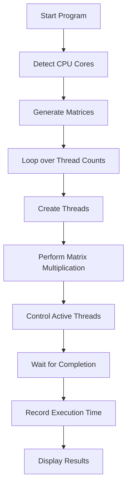
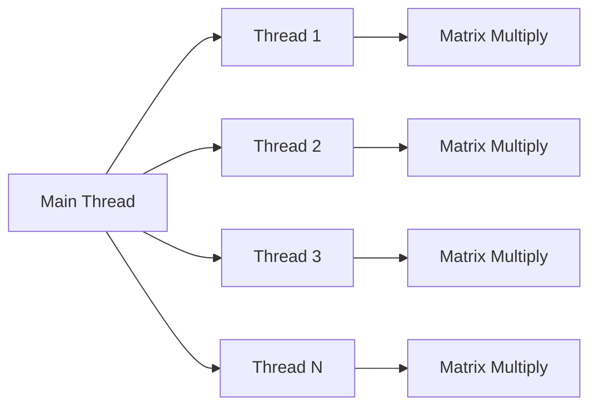

# 🚀 Multithreaded Matrix Multiplication Performance Analysis

## 📌 Overview
This project analyzes the performance of multithreading in Python for a CPU-bound task — matrix multiplication. It evaluates how execution time changes when the number of threads varies from 1 to 2× CPU cores.

---

## 🎯 Objectives
- Perform large-scale matrix multiplication
- Apply multithreading using Python
- Measure execution time for different thread counts
- Analyze performance scaling
- Understand limitations of threading (GIL)

---

## ⚙️ Technologies Used
- Python 🐍
- NumPy
- Threading module
- Multiprocessing (for CPU core detection)

---

## 🧠 Key Concepts
- Multithreading
- Concurrency control
- CPU-bound vs I/O-bound tasks
- Global Interpreter Lock (GIL)
- Context switching overhead

---

## 📂 Project Structure
```
📁 project-folder
│── main.py
│── README.md
```

---

## 🔄 Workflow


---

## 🧵 Thread Execution Model


---

## 📊 Experiment Setup

| Parameter | Value |
|----------|------|
| Matrix Size | 500 × 500 (adjustable) |
| Number of Matrices | 500 |
| Threads Range | 1 → 2 × CPU cores |
| Operation | Matrix Multiplication |

---

## ⏱️ Performance Behavior


---

## 📈 Expected Results

| Threads | Behavior |
|--------|---------|
| ≤ CPU Cores | Faster execution ✅ |
| ≈ CPU Cores | Best performance 🔥 |
| > CPU Cores | Slower execution ❌ |

---

## ⚠️ Important Observation

- This task is CPU-bound
- Python threading is limited by the Global Interpreter Lock (GIL)
- Increasing threads beyond CPU cores:
  - Causes context switching
  - Adds overhead
  - Reduces performance

---

## 🧪 Sample Output
```
Number of CPU cores: 4
Testing threads up to: 8

Running with 1 threads...
Threads = 1, Time = 10.2 min

Running with 4 threads...
Threads = 4, Time = 5.1 min

Running with 8 threads...
Threads = 8, Time = 7.8 min
```

---

## 🧾 Conclusion

- Multithreading improves performance up to CPU core limit
- Beyond that, overhead dominates
- Python threading is not ideal for CPU-bound tasks
- Multiprocessing is a better alternative

---

## 🚀 How to Run
```bash
pip install numpy
python main.py
```

---

## 💡 Future Improvements
- Use multiprocessing for better performance
- Add graphical visualization (Matplotlib)
- Implement ThreadPoolExecutor
- Compare threading vs multiprocessing

---

## 🏷️ Tags
multithreading, python, performance-analysis, matrix-multiplication, concurrency

---

## 👨‍💻 Author
Sparsh Gupta 
